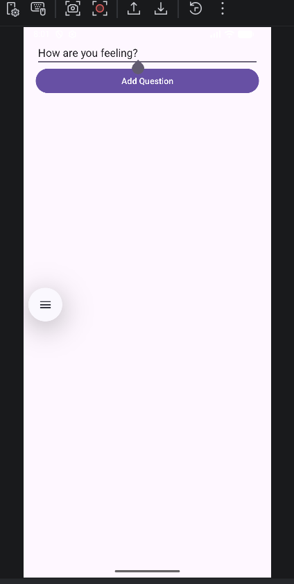
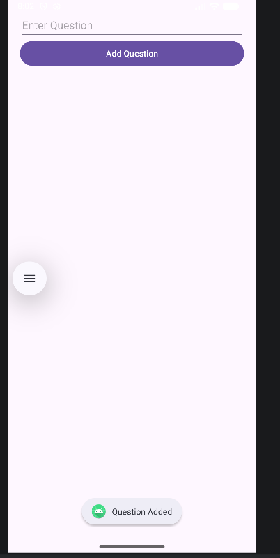

# 📱 Quick Survey Creator

A simple yet powerful Android app to create, take, and analyze surveys effortlessly. Designed for quick feedback collection, this project demonstrates core Android development concepts with a clean and intuitive UI.

---

## ✨ Features

* 📝 Create survey questions easily
* 📊 Collect user responses in real-time
* 📈 View summarized results clearly
* 🔄 Supports multiple questions
* 💾 Local data storage using SQLite
* 🎯 Simple and user-friendly interface

---

## 🛠️ Tech Stack

* **Language:** Java / Kotlin
* **Framework:** Android SDK
* **Database:** SQLite
* **IDE:** Android Studio

---

## 📸 Screenshots

### 🏠 Home Screen

<p align="center">
  
</p>

### 🛠️ Create Survey

<p align="center">
  
  
</p>

</p>

### 📋 Take Survey

<p align="center">
  
</p>

### 📊 Summary

<p align="center">
  
</p>

---

## 🚀 Getting Started

### Prerequisites

* Android Studio installed
* Android device or emulator

### Installation

1. Clone the repository

```bash
git clone https://github.com/rLikhitha-2525/SurveyApp.git
```

2. Open the project in Android Studio

3. Build and run the app

---

## 📂 Project Structure

* `MainActivity` → Navigation between features
* `CreateSurveyActivity` → Add questions
* `TakeSurveyActivity` → Answer surveys
* `SummaryActivity` → View results
* `DBHelper` → Database management

---

## 📊 How It Works

1. Create survey questions
2. Users answer using predefined options
3. Responses are stored locally
4. Summary displays aggregated results

---

## 🌱 Future Improvements

* Add dynamic options per question
* Use RecyclerView for better UI
* Cloud database integration (Firebase)
* Export survey results
* Authentication support

---

## 🤝 Contributing

Contributions are welcome! Feel free to fork the repo and submit a pull request.

---

## 📄 License

This project is open-source and available under the MIT License.

---

## 💡 Author

Made with ❤️ for learning and building real-world Android applications.